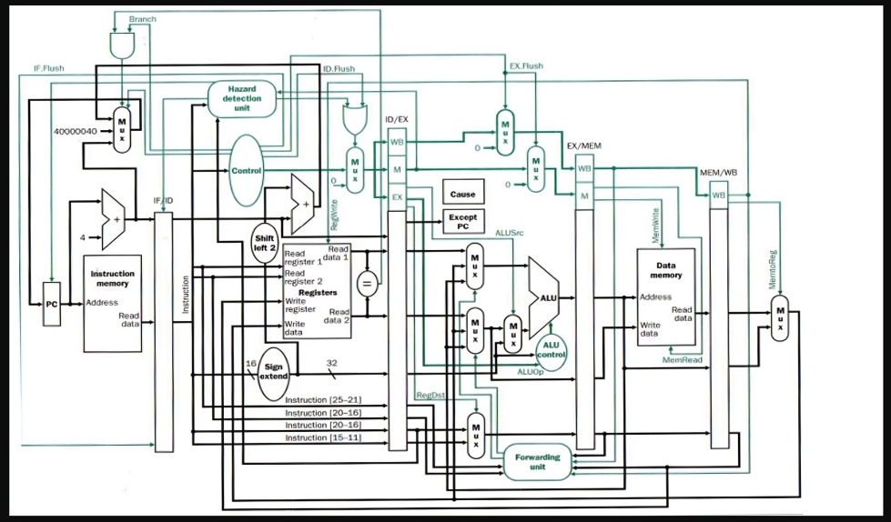

<p align="center">
  
  
</p>
<p align="center">
    <h1 align="center">MIPS-PROCESSOR</h1>
</p>
<p align="center">
    <em>Language have been used</em>
</p>
<p align="center">
	
	
	
	
<p>
<p align="center">
		<em>Developed with the software and tools below.</em>
</p>
<p align="center">
	
	
	
	
</p>

<hr>

##  Quick Liks

> - [ Overview](#overview)
> - [ Imge Architecture](#imge-architecture)
> - [ Features](#features)
> - [ Repository Structure](#repository-structure)
> - [ Assembly Code Description](#assembly-code-description)
> - [ Modules](#modules)
> - [ Getting Started](#getting-started)
>   - [ Requirements](#requirements)
>   - [ Installation](#installation)
>   - [ Running MIPS-Processor](#running-mips-processor)
> - [ Contributing](#contributing)
> - [ Contact info](#contact-info)

---

##  Overview

This repository contains the Verilog implementation of a MIPS processor core with pipeline, hazard solution, and exception handling, along with the corresponding testbenches.

---

## Imge Architecture

**This architectural design is created by *[Amr Elbatarny](https://www.linkedin.com/in/amr-el-batarny-428b19231/)*.**


---

##  Features

- **MIPS Processor Core**: The processor core is implemented in Verilog, supporting the following MIPS instructions:
  - Arithmetic and Logical Instructions: `ADD`, `ADDI`, `SUB`, `AND`, `OR`, `NOR`, `SLT`, `SLTI`
  - Load and Store Instructions: `LW`, `SW`
  - Branch Instructions: `BEQ`, `BNE`
- **Pipeline Architecture**: The processor core is designed with a 5-stage pipeline (Fetch, Decode, Execute, Memory, Writeback) to improve performance.
- **Hazard Detection and Forwarding**: The pipeline design includes hazard detection and forwarding mechanisms to handle data hazards and control hazards.
- **Exception Handling**: The processor core can handle exceptions, such as illegal instructions and address errors, and provides a dedicated exception handler.

---

##  Repository Structure

```sh
└── MIPS-Processor/
    ├── DataMemory.dat
    ├── Documents
    │   ├── Architecture.png
    │   ├── Elaboration schmatic.pdf
    │   └── MIPS Processor.pdf
    ├── ExceptionInstruction.dat
    ├── ExceptionRegisterData.dat
    ├── InstructionData.dat
    ├── Quartus Archive Project
    │   └── MIPS.qar
    ├── Quartus Timing Analysis Snippets
    │   ├── Fmax.png
    │   ├── Hold Slack.png
    │   ├── clk Constraint.png
    │   ├── clk Slack Histogram.png
    │   └── setup slack.png
    ├── README.md
    ├── RTL
    │   ├── ALUControl.v
    │   ├── BranchTargetAddress.v
    │   ├── ControlUnit.v
    │   ├── Controller.v
    │   ├── DataPath.v
    │   ├── Datamemory.v
    │   ├── EX_MEM_REG.v
    │   ├── ForwardingUnit.v
    │   ├── HazardDetectionUnit.v
    │   ├── ID_EX_REG.v
    │   ├── IF_ID_REG.v
    │   ├── InstructionMemory.v
    │   ├── IsEqual.v
    │   ├── MEM_WB_REG.v
    │   ├── MainALU.v
    │   ├── PCadder.v
    │   ├── Processor.v
    │   ├── ProgramCounter.v
    │   ├── RegistersFile.v
    │   ├── SignExtend.v
    │   ├── muxNbit_2_1.v
    │   └── muxNbit_3_1.v
    ├── RegisterData.dat
    ├── run.tcl
    ├── runException.tcl
    ├── Assembly TestCode
    │   ├── Exception_TestCode.s
    │   └── testbench.sv
    └── testbench
        ├── TestCode.s
        └── tb_Exception.sv
```

---

## Assembly Code Description

The two MIPS assembly code files, TestCode.s and Exception_TestCode.s, are used to test the functionality of the MIPS processor core.

1. TestCode.s:
- This file contains a set of MIPS instructions that test the basic functionality of the processor, including arithmetic, logical, load, store, and branch operations.
- The code performs various calculations, loads and stores data, and tests the branch instructions.
- That MIPS assembly code performs the following tasks:
    * Initializes an array with 6 elements: 5, 9, 19, 12, 1, and 15.
    * Finds the maximum (MAX) and minimum (MIN) values in the array and stores it in registers ($t2) and ($t3) in order.
    * Calculates the sum of all elements in the array and stores it in registers ($s0).

2. Exception_TestCode.s:
- This file contains a set of MIPS instructions that test the exception handling capabilities of the processor core.
- That MIPS assembly code tests two types of exceptions:

    - Overflow Exception: The code intentionally causes an overflow exception by adding a large value to a register, causing the result to exceed the maximum representable value.
    - Invalid Instruction Exception: The code uses an invalid instruction (*SWL*) to trigger an exception.

---

##  Modules

<details closed><summary>TCL</summary>

| File                                                                                                   | Summary                                      |
| ---                                                                                                    | ---                                          |
| [run.tcl](https://github.com/Abdelrahman1810/MIPS-Processor.git/blob/master/run.tcl)                   | run Normal Simulation Case `run.tcl`          |
| [runException.tcl](https://github.com/Abdelrahman1810/MIPS-Processor.git/blob/master/runException.tcl) | run Exception Simulation Case `runException.tcl` |

</details>

<details closed><summary>Assembly TestCode</summary>

| File                                                                                                                     | Summary                                                    |
| ---                                                                                                                      | ---                                                        |
| [TestCode.s](https://github.com/Abdelrahman1810/MIPS-Processor.git/blob/master/testbench/TestCode.s)                     | Normal Functionality TestCode `testbench/TestCode.s`           |
| [Exception_TestCode.s](https://github.com/Abdelrahman1810/MIPS-Processor.git/blob/master/testbench/Exception_TestCode.s) | Exception TestCode `testbench/Exception_TestCode.s` |

</details>

<details closed><summary>testbench</summary>

| File                                                                                                                     | Summary                                                    |
| ---                                                                                                                      | ---                    
| [tb_Exception.sv](https://github.com/Abdelrahman1810/MIPS-Processor.git/blob/master/testbench/tb_Exception.sv)           | `testbench/tb_Exception.sv`      |
| [testbench.sv](https://github.com/Abdelrahman1810/MIPS-Processor.git/blob/master/testbench/testbench.sv)                 | `testbench/testbench.sv`         |

</details>

<details closed><summary>RTL</summary>

| File                                                                                                                 | Summary                                               |
| ---                                                                                                                  | ---                                                   |
| [muxNbit_3_1.v](https://github.com/Abdelrahman1810/MIPS-Processor.git/blob/master/RTL/muxNbit_3_1.v)                 | `RTL/muxNbit_3_1.v`         |
| [RegistersFile.v](https://github.com/Abdelrahman1810/MIPS-Processor.git/blob/master/RTL/RegistersFile.v)             | `RTL/RegistersFile.v`       |
| [muxNbit_2_1.v](https://github.com/Abdelrahman1810/MIPS-Processor.git/blob/master/RTL/muxNbit_2_1.v)                 | `RTL/muxNbit_2_1.v`         |
| [Datamemory.v](https://github.com/Abdelrahman1810/MIPS-Processor.git/blob/master/RTL/Datamemory.v)                   | `RTL/Datamemory.v`          |
| [IsEqual.v](https://github.com/Abdelrahman1810/MIPS-Processor.git/blob/master/RTL/IsEqual.v)                         | `RTL/IsEqual.v`             |
| [BranchTargetAddress.v](https://github.com/Abdelrahman1810/MIPS-Processor.git/blob/master/RTL/BranchTargetAddress.v) | `RTL/BranchTargetAddress.v` |
| [ForwardingUnit.v](https://github.com/Abdelrahman1810/MIPS-Processor.git/blob/master/RTL/ForwardingUnit.v)           | `RTL/ForwardingUnit.v`      |
| [ProgramCounter.v](https://github.com/Abdelrahman1810/MIPS-Processor.git/blob/master/RTL/ProgramCounter.v)           | `RTL/ProgramCounter.v`      |
| [MainALU.v](https://github.com/Abdelrahman1810/MIPS-Processor.git/blob/master/RTL/MainALU.v)                         | `RTL/MainALU.v`             |
| [EX_MEM_REG.v](https://github.com/Abdelrahman1810/MIPS-Processor.git/blob/master/RTL/EX_MEM_REG.v)                   | `RTL/EX_MEM_REG.v`          |
| [IF_ID_REG.v](https://github.com/Abdelrahman1810/MIPS-Processor.git/blob/master/RTL/IF_ID_REG.v)                     | `RTL/IF_ID_REG.v`           |
| [Processor.v](https://github.com/Abdelrahman1810/MIPS-Processor.git/blob/master/RTL/Processor.v)                     | `RTL/Processor.v`           |
| [HazardDetectionUnit.v](https://github.com/Abdelrahman1810/MIPS-Processor.git/blob/master/RTL/HazardDetectionUnit.v) | `RTL/HazardDetectionUnit.v` |
| [ALUControl.v](https://github.com/Abdelrahman1810/MIPS-Processor.git/blob/master/RTL/ALUControl.v)                   | `RTL/ALUControl.v`          |
| [DataPath.v](https://github.com/Abdelrahman1810/MIPS-Processor.git/blob/master/RTL/DataPath.v)                       | `RTL/DataPath.v`            |
| [ControlUnit.v](https://github.com/Abdelrahman1810/MIPS-Processor.git/blob/master/RTL/ControlUnit.v)                 | `RTL/ControlUnit.v`         |
| [ID_EX_REG.v](https://github.com/Abdelrahman1810/MIPS-Processor.git/blob/master/RTL/ID_EX_REG.v)                     | `RTL/ID_EX_REG.v`           |
| [MEM_WB_REG.v](https://github.com/Abdelrahman1810/MIPS-Processor.git/blob/master/RTL/MEM_WB_REG.v)                   | `RTL/MEM_WB_REG.v`          |
| [Controller.v](https://github.com/Abdelrahman1810/MIPS-Processor.git/blob/master/RTL/Controller.v)                   | `RTL/Controller.v`          |
| [PCadder.v](https://github.com/Abdelrahman1810/MIPS-Processor.git/blob/master/RTL/PCadder.v)                         | `RTL/PCadder.v`             |
| [InstructionMemory.v](https://github.com/Abdelrahman1810/MIPS-Processor.git/blob/master/RTL/InstructionMemory.v)     | `RTL/InstructionMemory.v`   |
| [SignExtend.v](https://github.com/Abdelrahman1810/MIPS-Processor.git/blob/master/RTL/SignExtend.v)                   | `RTL/SignExtend.v`          |

</details>

---

##  Getting Started

### Requirements
> [!IMPORTANT]
> Ensure you have the following dependencies installed on your system:
 
* **QuestaSim**: [download link](https://eda.sw.siemens.com/en-US/ic/questa/simulation/advanced-simulator/) 
* **Quartus**: [download link](https://www.intel.com/content/www/us/en/products/details/fpga/development-tools/quartus-prime/resource.html)
* **VIVADO**:  [download link](https://www.xilinx.com/support/download.html)
* **Any TesxtEditor (E.g VScode, sublime Text,..,etc)**: [VScode](https://code.visualstudio.com/Download), [sublime](https://www.sublimetext.com/download)

###  Installation

1. Clone the MIPS-Processor repository:

    ```sh
    git clone https://github.com/Abdelrahman1810/MIPS-Processor.git
    ```

###  Running MIPS-Processor

1. Make new project in Questa 

    ```sh
    file -> new Project
    ```

2. add path where the repository in

3. run this comand in Questa transcript to simulate Normal Functionality

   ```ruby
   do run.tcl
   ```
4. run this comand in Questa transcript to simulate Exception Functionality

   ```ruby
   do runException.tcl
   ```

---

##  Contributing

If you find any issues or have suggestions for improvement, feel free to submit a pull request or open an issue in the repository. Contributions are always welcome!

<details closed>
    <summary>Contributing Guidelines</summary>

1. **Fork the Repository**: Start by forking the project repository to your GitHub account.
2. **Clone Locally**: Clone the forked repository to your local machine using a Git client.
   ```sh
   git clone https://github.com/Abdelrahman1810/MIPS-Processor.git
   ```
3. **Create a New Branch**: Always work on a new branch, giving it a descriptive name.
   ```sh
   git checkout -b new-feature-x
   ```
4. **Make Your Changes**: Develop and test your changes locally.
5. **Commit Your Changes**: Commit with a clear message describing your updates.
   ```sh
   git commit -m 'Implemented new feature x.'
   ```
6. **Push to GitHub**: Push the changes to your forked repository.
   ```sh
   git push origin new-feature-x
   ```
7. **Submit a Pull Request**: Create a PR against the original project repository. Clearly describe the changes and their motivations.

Once your PR is reviewed and approved, it will be merged into the main branch.

</details>

---

## Contact info

<a href="https://linktr.ee/A_Hassanen" target="_blank">
  
</a> 
<br>
<br>
<br>


[**Return**](#quick-liks)
---